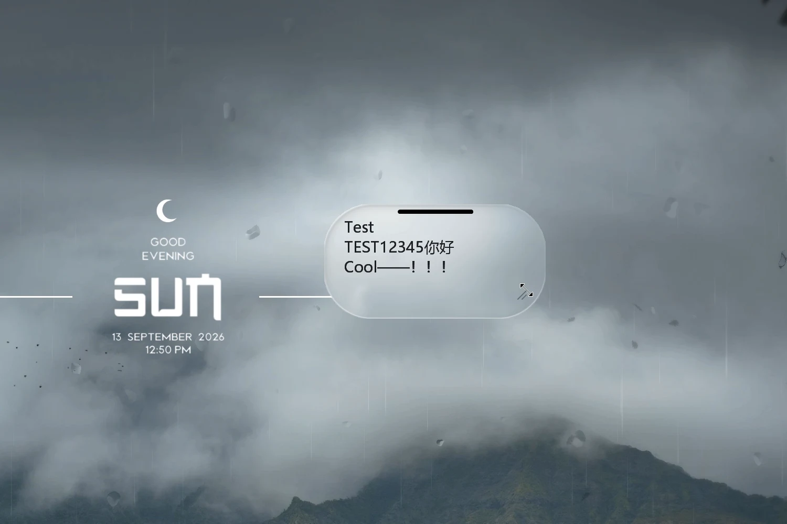
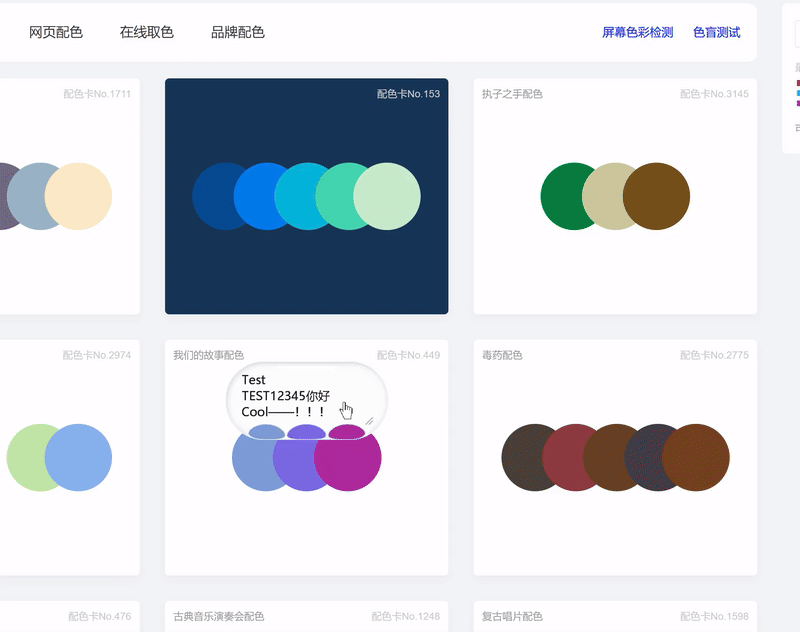
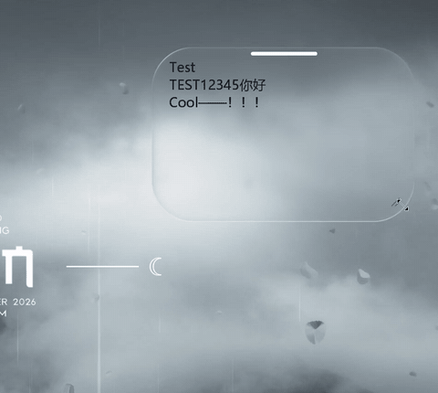
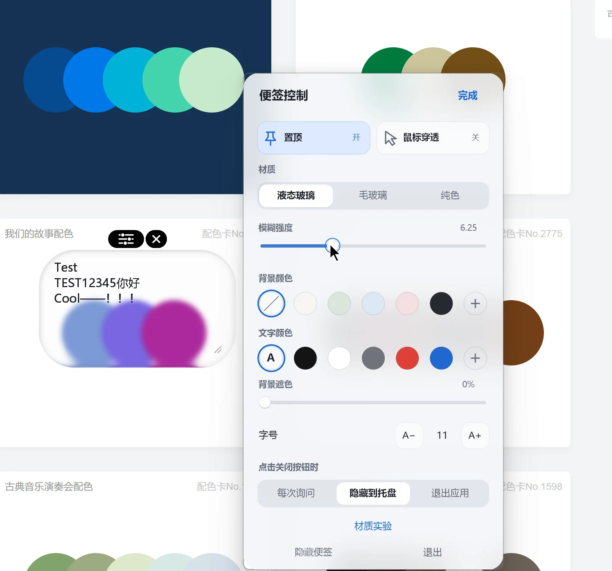

# FloatNote — Native Liquid Glass for Windows

English · [简体中文](README.md)

**A native Windows floating note with Liquid Glass.** Live refraction, spring animations, always-on-top and mouse click-through. Notes and preferences stay local. No accounts or telemetry.



> Recorded from a local development build. The visual and interaction improvements shown are included in v2.1.0.

**[Download the latest release](https://github.com/Fryingpan-Jason/FloatNote-Liquid-Glass/releases/latest)** · [Liquid Glass implementation](docs/WINDOWS_LIQUID_GLASS.md)

## See it in action

Drag the note to see background refraction and text changes.



Shrink the note vertically into a compact bar; click to restore. This GIF plays at approximately 1.43× speed.



<details>
<summary>Appearance settings</summary>

Liquid glass, frosted glass or solid backgrounds, with color, font size, blur, pinning and click-through controls.



</details>

## Download and use

Choose a portable ZIP on the release page, extract it, and run `FloatNote.exe`. No additional runtime installation is required.

- **x64**: most Intel / AMD PCs.
- **arm64**: Windows on ARM devices.
- **x86**: 32-bit environments.

Choose an application ZIP, not **Source code**. Extract into a writable folder. Binaries are unsigned and may trigger SmartScreen; SHA-256 checksums are included on the release page.

- Hover near the top to reveal controls; drag the bottom-right grip to resize.
- `Ctrl+Alt+E` restores editing; `Ctrl+Alt+H` toggles visibility; `Ctrl+Alt+P` toggles click-through.
- `Ctrl+wheel` changes font size. Double-click the tray icon to recover the note.
- To upgrade, exit the old app and replace the executable. **Keep and back up the existing `data` folder.**

## Compatibility

Liquid glass targets supported Windows 11 environments, with fallback where needed. Some screenshot, recording and remote-sharing methods may omit the live glass note; switch to frosted glass when necessary. See [compatibility](docs/COMPATIBILITY.md).

The settings panel, close prompt and material controls are currently in Chinese. Screen pixels are processed locally on the GPU, never uploaded.

## Development

Built with C++/Win32, Direct3D 11, HLSL and Windows Graphics Capture under the MIT license. Explore the [Liquid Glass implementation](docs/WINDOWS_LIQUID_GLASS.md); this is not a standalone SDK.

With Visual Studio C++ tools and a Windows SDK:

```powershell
.\build.ps1 -Architecture x64 -OutputDirectory build\x64
.\build.ps1 -Test -OutputDirectory build\tests
.\scripts\package.ps1 -Architecture x64
```

[Development guide](docs/DEVELOPMENT.md) · [Third-party notices](THIRD_PARTY_NOTICES.md)
